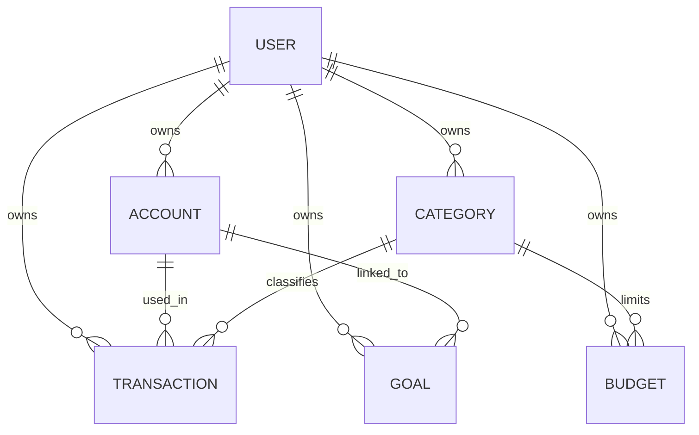

# Database Schema

Документ описывает проектируемую структуру базы данных backend-части BudgetWise: таблицы, связи, ключи, ограничения целостности и индексы.

Схема основана на доменной модели из `docs/domain-model.md` и предварительном API-контракте из `docs/api-contract.md`.

## Общий подход

В качестве основной базы данных используется PostgreSQL.

Основные принципы проектирования:

- все финансовые данные принадлежат конкретному пользователю;
- суммы хранятся через decimal/numeric, не через float;
- основные сущности имеют поля `created_at` и `updated_at`;
- пользовательские данные фильтруются по владельцу;
- для частых запросов добавляются индексы;
- ограничения целостности задаются на уровне ORM и базы данных там, где это возможно.

## Таблицы MVP

В MVP используются следующие основные таблицы:

| Таблица | Django model | Назначение |
|---|---|---|
| `users_user` | `User` | Пользователь приложения |
| `finance_account` | `Account` | Виртуальный финансовый счёт пользователя |
| `finance_category` | `Category` | Категория доходов или расходов |
| `finance_transaction` | `Transaction` | Финансовая операция |
| `finance_budget` | `Budget` | Бюджетное ограничение |
| `finance_goal` | `Goal` | Финансовая цель |

Служебные таблицы Django, например `auth_group`, `django_admin_log`, `django_session` и таблицы `token_blacklist`, создаются стандартными миграциями Django и Simple JWT.

## Таблица `users_user`

Таблица хранит пользователей приложения.

Пользовательская модель основана на Django `AbstractUser`, поэтому содержит стандартные поля Django User и дополнительное ограничение уникальности `email`.

### Основные поля

| Поле | Тип | Ограничения | Описание |
|---|---|---|---|
| `id` | bigint | PK, auto increment | Уникальный идентификатор |
| `password` | varchar | NOT NULL | Хеш пароля |
| `last_login` | timestamp with time zone | NULL | Последний вход |
| `is_superuser` | boolean | NOT NULL | Признак суперпользователя |
| `username` | varchar | UNIQUE, NOT NULL | Имя пользователя |
| `first_name` | varchar | NOT NULL, default empty | Имя |
| `last_name` | varchar | NOT NULL, default empty | Фамилия |
| `email` | varchar | UNIQUE, NOT NULL | Email пользователя |
| `is_staff` | boolean | NOT NULL | Доступ в admin |
| `is_active` | boolean | NOT NULL | Активность пользователя |
| `date_joined` | timestamp with time zone | NOT NULL | Дата регистрации |

### Индексы и ограничения

| Тип | Поля | Назначение |
|---|---|---|
| Primary key | `id` | Быстрый поиск пользователя |
| Unique | `username` | Уникальность имени пользователя |
| Unique | `email` | Уникальность email |

## Таблица `finance_account`

Таблица хранит виртуальные финансовые счета пользователя.

Это не реальные банковские счета. Счёт используется внутри приложения для учёта денег: карта, наличные, накопительный счёт.

### Поля

| Поле | Тип | Ограничения | Описание |
|---|---|---|---|
| `id` | bigint | PK, auto increment | Уникальный идентификатор |
| `user_id` | bigint | FK, NOT NULL | Владелец счёта |
| `name` | varchar(100) | NOT NULL | Название счёта |
| `balance` | numeric(14, 2) | NOT NULL, default 0 | Текущий баланс |
| `currency` | varchar(3) | NOT NULL, default `RUB` | Валюта |
| `is_active` | boolean | NOT NULL, default true | Активность счёта |
| `created_at` | timestamp with time zone | NOT NULL | Дата создания |
| `updated_at` | timestamp with time zone | NOT NULL | Дата обновления |

### Связи

| Поле | Связь | Поведение |
|---|---|---|
| `user_id` | `users_user.id` | `CASCADE` |

Если пользователь удаляется, его счета также удаляются.

### Ограничения

| Тип | Поля | Назначение |
|---|---|---|
| Primary key | `id` | Уникальный идентификатор |
| Foreign key | `user_id` | Связь с пользователем |
| Unique | `user_id`, `name` | У пользователя не должно быть двух счетов с одинаковым названием |
| Check | `balance` | Баланс хранится как decimal-значение |
| Check | `currency` | Валюта должна быть трёхбуквенным кодом |

Баланс может быть отрицательным, если пользователь допускает долг или кредитный счёт. Если в дальнейшем будет принято решение запретить отрицательный баланс, это ограничение добавляется отдельной миграцией.

### Индексы

| Индекс | Поля | Назначение |
|---|---|---|
| `idx_account_user` | `user_id` | Получение счетов пользователя |
| `idx_account_user_active` | `user_id`, `is_active` | Получение активных счетов пользователя |
| `idx_account_user_name` | `user_id`, `name` | Поиск счёта по названию внутри пользователя |

## Таблица `finance_category`

Таблица хранит категории доходов и расходов.

### Поля

| Поле | Тип | Ограничения | Описание |
|---|---|---|---|
| `id` | bigint | PK, auto increment | Уникальный идентификатор |
| `user_id` | bigint | FK, NOT NULL | Владелец категории |
| `name` | varchar(100) | NOT NULL | Название категории |
| `type` | varchar(20) | NOT NULL | Тип: `income` или `expense` |
| `is_active` | boolean | NOT NULL, default true | Активность категории |
| `created_at` | timestamp with time zone | NOT NULL | Дата создания |
| `updated_at` | timestamp with time zone | NOT NULL | Дата обновления |

### Связи

| Поле | Связь | Поведение |
|---|---|---|
| `user_id` | `users_user.id` | `CASCADE` |

Если пользователь удаляется, его категории также удаляются.

### Ограничения

| Тип | Поля | Назначение |
|---|---|---|
| Primary key | `id` | Уникальный идентификатор |
| Foreign key | `user_id` | Связь с пользователем |
| Unique | `user_id`, `name`, `type` | У пользователя не должно быть дублей категорий одного типа |
| Check | `type` | Только `income` или `expense` |

### Индексы

| Индекс | Поля | Назначение |
|---|---|---|
| `idx_category_user` | `user_id` | Получение категорий пользователя |
| `idx_category_user_type` | `user_id`, `type` | Фильтрация категорий по типу |
| `idx_category_user_active` | `user_id`, `is_active` | Получение активных категорий |
| `idx_category_user_name_type` | `user_id`, `name`, `type` | Проверка дублей и поиск категории |

## Таблица `finance_transaction`

Таблица хранит финансовые операции пользователя.

Операция может быть доходом или расходом.

### Поля

| Поле | Тип | Ограничения | Описание |
|---|---|---|---|
| `id` | bigint | PK, auto increment | Уникальный идентификатор |
| `user_id` | bigint | FK, NOT NULL | Владелец операции |
| `account_id` | bigint | FK, NOT NULL | Счёт операции |
| `category_id` | bigint | FK, NOT NULL | Категория операции |
| `type` | varchar(20) | NOT NULL | Тип: `income` или `expense` |
| `amount` | numeric(14, 2) | NOT NULL | Сумма операции |
| `description` | text | NULL или blank | Описание |
| `operation_date` | date | NOT NULL | Дата операции |
| `created_at` | timestamp with time zone | NOT NULL | Дата создания |
| `updated_at` | timestamp with time zone | NOT NULL | Дата обновления |

### Связи

| Поле | Связь | Поведение |
|---|---|---|
| `user_id` | `users_user.id` | `CASCADE` |
| `account_id` | `finance_account.id` | `PROTECT` или `CASCADE` |
| `category_id` | `finance_category.id` | `PROTECT` или `SET_NULL`, если категория станет необязательной |

Для MVP лучше использовать:

- `account_id` с `PROTECT`, чтобы случайно не удалить счёт с историей операций;
- `category_id` с `PROTECT`, чтобы не потерять смысл старых операций.

Если в будущем понадобится удалять счета и категории вместе с операциями, это решение можно пересмотреть.

### Ограничения

| Тип | Поля | Назначение |
|---|---|---|
| Primary key | `id` | Уникальный идентификатор |
| Foreign key | `user_id` | Связь с пользователем |
| Foreign key | `account_id` | Связь со счётом |
| Foreign key | `category_id` | Связь с категорией |
| Check | `amount > 0` | Сумма операции должна быть положительной |
| Check | `type` | Только `income` или `expense` |

Дополнительные правила целостности:

- `account.user_id` должен совпадать с `transaction.user_id`;
- `category.user_id` должен совпадать с `transaction.user_id`;
- `category.type` должен совпадать с `transaction.type`.

Эти правила сложно полностью выразить обычным `CheckConstraint`, потому что они зависят от связанных таблиц. Поэтому они должны проверяться на уровне serializers, services и тестов.

### Индексы

| Индекс | Поля | Назначение |
|---|---|---|
| `idx_transaction_user` | `user_id` | Получение операций пользователя |
| `idx_transaction_user_date` | `user_id`, `operation_date` | История операций и фильтр по периоду |
| `idx_transaction_account_date` | `account_id`, `operation_date` | Операции по счёту за период |
| `idx_transaction_category_date` | `category_id`, `operation_date` | Операции по категории за период |
| `idx_transaction_user_type_date` | `user_id`, `type`, `operation_date` | Отчёты по доходам и расходам |
| `idx_transaction_user_created` | `user_id`, `created_at` | Сортировка по дате создания |

## Таблица `finance_budget`

Таблица хранит бюджетные ограничения пользователя.

### Поля

| Поле | Тип | Ограничения | Описание |
|---|---|---|---|
| `id` | bigint | PK, auto increment | Уникальный идентификатор |
| `user_id` | bigint | FK, NOT NULL | Владелец бюджета |
| `category_id` | bigint | FK, NOT NULL | Категория бюджета |
| `amount_limit` | numeric(14, 2) | NOT NULL | Лимит бюджета |
| `period_start` | date | NOT NULL | Начало периода |
| `period_end` | date | NOT NULL | Конец периода |
| `is_active` | boolean | NOT NULL, default true | Активность бюджета |
| `created_at` | timestamp with time zone | NOT NULL | Дата создания |
| `updated_at` | timestamp with time zone | NOT NULL | Дата обновления |

### Связи

| Поле | Связь | Поведение |
|---|---|---|
| `user_id` | `users_user.id` | `CASCADE` |
| `category_id` | `finance_category.id` | `PROTECT` |

Категорию, которая используется в бюджете, лучше не удалять физически. Вместо удаления можно использовать `is_active=False`.

### Ограничения

| Тип | Поля | Назначение |
|---|---|---|
| Primary key | `id` | Уникальный идентификатор |
| Foreign key | `user_id` | Связь с пользователем |
| Foreign key | `category_id` | Связь с категорией |
| Check | `amount_limit > 0` | Лимит должен быть положительным |
| Check | `period_end >= period_start` | Период должен быть корректным |
| Unique | `user_id`, `category_id`, `period_start`, `period_end` | Один бюджет на категорию за одинаковый период |

Дополнительные правила:

- категория бюджета должна принадлежать тому же пользователю;
- бюджет обычно применяется к категории типа `expense`.

Эти правила проверяются на уровне serializers, services и тестов.

### Индексы

| Индекс | Поля | Назначение |
|---|---|---|
| `idx_budget_user` | `user_id` | Получение бюджетов пользователя |
| `idx_budget_user_period` | `user_id`, `period_start`, `period_end` | Поиск бюджетов за период |
| `idx_budget_user_category_period` | `user_id`, `category_id`, `period_start`, `period_end` | Проверка бюджета по категории и периоду |
| `idx_budget_user_active` | `user_id`, `is_active` | Получение активных бюджетов |

## Таблица `finance_goal`

Таблица хранит финансовые цели пользователя.

### Поля

| Поле | Тип | Ограничения | Описание |
|---|---|---|---|
| `id` | bigint | PK, auto increment | Уникальный идентификатор |
| `user_id` | bigint | FK, NOT NULL | Владелец цели |
| `account_id` | bigint | FK, NULL | Связанный счёт |
| `name` | varchar(150) | NOT NULL | Название цели |
| `target_amount` | numeric(14, 2) | NOT NULL | Целевая сумма |
| `current_amount` | numeric(14, 2) | NOT NULL, default 0 | Текущая накопленная сумма |
| `deadline` | date | NULL | Желаемая дата достижения |
| `status` | varchar(20) | NOT NULL, default `active` | Статус цели |
| `created_at` | timestamp with time zone | NOT NULL | Дата создания |
| `updated_at` | timestamp with time zone | NOT NULL | Дата обновления |

### Связи

| Поле | Связь | Поведение |
|---|---|---|
| `user_id` | `users_user.id` | `CASCADE` |
| `account_id` | `finance_account.id` | `SET_NULL` |

Если связанный счёт удалён, цель может остаться без счёта.

### Ограничения

| Тип | Поля | Назначение |
|---|---|---|
| Primary key | `id` | Уникальный идентификатор |
| Foreign key | `user_id` | Связь с пользователем |
| Foreign key | `account_id` | Необязательная связь со счётом |
| Check | `target_amount > 0` | Целевая сумма должна быть положительной |
| Check | `current_amount >= 0` | Текущая сумма не может быть отрицательной |
| Check | `status` | Только `active`, `completed`, `cancelled` |
| Unique | `user_id`, `name` | У пользователя не должно быть двух целей с одинаковым названием |

Дополнительное правило:

- если `account_id` указан, счёт должен принадлежать тому же пользователю.

Это правило проверяется на уровне serializers, services и тестов.

### Индексы

| Индекс | Поля | Назначение |
|---|---|---|
| `idx_goal_user` | `user_id` | Получение целей пользователя |
| `idx_goal_user_status` | `user_id`, `status` | Фильтр целей по статусу |
| `idx_goal_user_deadline` | `user_id`, `deadline` | Сортировка и фильтрация по сроку |
| `idx_goal_user_account` | `user_id`, `account_id` | Получение целей по счёту |

## Сводная схема связей

## Частые запросы и покрытие индексами

| Сценарий | Таблица | Индексы |
|---|---|---|
| Получить счета пользователя | `finance_account` | `user_id` |
| Получить активные счета пользователя | `finance_account` | `user_id`, `is_active` |
| Получить категории расходов | `finance_category` | `user_id`, `type` |
| Получить операции за период | `finance_transaction` | `user_id`, `operation_date` |
| Получить операции по счёту за период | `finance_transaction` | `account_id`, `operation_date` |
| Получить операции по категории за период | `finance_transaction` | `category_id`, `operation_date` |
| Сформировать отчёт доходов и расходов | `finance_transaction` | `user_id`, `type`, `operation_date` |
| Получить бюджеты за период | `finance_budget` | `user_id`, `period_start`, `period_end` |
| Получить активные цели | `finance_goal` | `user_id`, `status` |
| Отсортировать цели по сроку | `finance_goal` | `user_id`, `deadline` |

## Решения по удалению данных

| Сущность | Поведение |
|---|---|
| `User` | При удалении пользователя удаляются его финансовые данные |
| `Account` | Не должен удаляться, если есть связанные операции |
| `Category` | Не должна удаляться, если есть связанные операции или бюджеты |
| `Transaction` | Может быть удалена пользователем, если принадлежит ему |
| `Budget` | Может быть удалён пользователем, если принадлежит ему |
| `Goal` | Может быть удалена пользователем, если принадлежит ему |

Для счетов и категорий предпочтительно использовать мягкое отключение через `is_active=False`, чтобы сохранить историю операций.

## Правила соответствия API-контракту

Схема базы данных должна поддерживать основные endpoints из `docs/api-contract.md`:

| API resource | Таблица |
|---|---|
| `/api/v1/users/me/` | `users_user` |
| `/api/v1/finance/accounts/` | `finance_account` |
| `/api/v1/finance/categories/` | `finance_category` |
| `/api/v1/finance/transactions/` | `finance_transaction` |
| `/api/v1/finance/reports/summary/` | `finance_transaction`, `finance_account`, `finance_category` |
| `/api/v1/finance/budgets/` | `finance_budget` |
| `/api/v1/finance/goals/` | `finance_goal` |

## Итог

Проектируемая схема базы данных включает пользователя и основные финансовые сущности: счета, категории, операции, бюджеты и цели.

Схема поддерживает:

- хранение пользовательских финансовых данных;
- разграничение данных по владельцу;
- базовые ограничения целостности;
- частые запросы через индексы;
- дальнейшую реализацию REST API по текущему API-контракту.