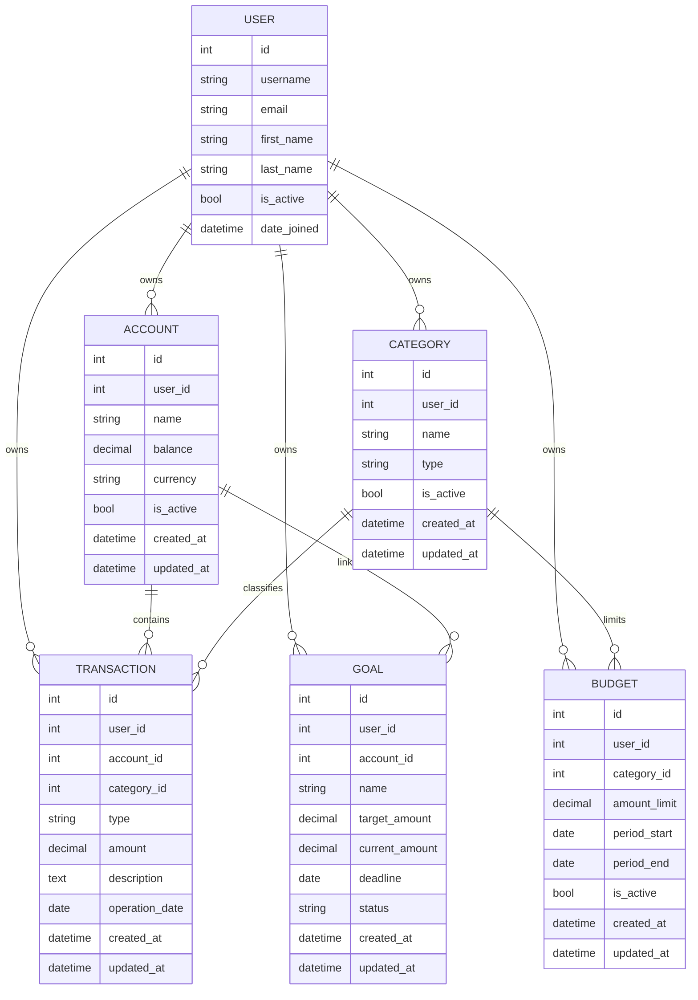

# Domain Model

Документ описывает основные доменные сущности backend-части приложения BudgetWise и связи между ними.

Проект представляет собой серверную часть приложения для управления личными финансами. Основная задача доменной модели - описать пользователей, их финансовые счета, категории, операции, бюджеты и цели.

## Основные сущности

В рамках MVP используются следующие доменные сущности:

| Сущность | Назначение |
|---|---|
| `User` | Пользователь системы |
| `Account` | Виртуальный финансовый счёт пользователя |
| `Category` | Категория доходов или расходов |
| `Transaction` | Финансовая операция пользователя |
| `Budget` | Бюджетное ограничение по категории и периоду |
| `Goal` | Финансовая цель пользователя |

Сущности `Report` или `Analytics` не выделяются в отдельные таблицы на этапе MVP. Отчёты формируются на основе операций, счетов и категорий.

## User

`User` представляет пользователя приложения.

В проекте используется пользовательская модель на базе Django `AbstractUser`.

Основные поля:

| Поле | Тип | Описание |
|---|---|---|
| `id` | integer | Уникальный идентификатор пользователя |
| `username` | string | Имя пользователя |
| `email` | string | Email пользователя |
| `first_name` | string | Имя |
| `last_name` | string | Фамилия |
| `is_active` | boolean | Активен ли пользователь |
| `date_joined` | datetime | Дата регистрации |

Особенности:

- `email` должен быть уникальным;
- пользователь является владельцем своих финансовых данных;
- пользователь не должен иметь доступ к счетам, категориям и операциям других пользователей.

## Account

`Account` представляет виртуальный финансовый счёт пользователя внутри приложения.

Это не реальный банковский счёт. Сущность используется для учёта денежных средств в приложении, например карта, наличные, накопительный счёт.

Основные поля:

| Поле | Тип | Описание |
|---|---|---|
| `id` | integer | Уникальный идентификатор счёта |
| `user` | FK to User | Владелец счёта |
| `name` | string | Название счёта |
| `balance` | decimal | Текущий баланс |
| `currency` | string | Валюта счёта |
| `is_active` | boolean | Активен ли счёт |
| `created_at` | datetime | Дата создания |
| `updated_at` | datetime | Дата обновления |

Связи:

- один пользователь может иметь много счетов;
- один счёт принадлежит только одному пользователю;
- операции привязываются к конкретному счёту.

Ограничения:

- название счёта должно быть обязательным;
- валюта должна быть обязательной;
- баланс хранится как decimal, не float;
- пользователь может работать только со своими счетами.

## Category

`Category` представляет категорию доходов или расходов.

Примеры категорий:

- продукты;
- транспорт;
- зарплата;
- развлечения;
- аренда;
- здоровье.

Основные поля:

| Поле | Тип | Описание |
|---|---|---|
| `id` | integer | Уникальный идентификатор категории |
| `user` | FK to User | Владелец категории |
| `name` | string | Название категории |
| `type` | string | Тип категории: `income` или `expense` |
| `is_active` | boolean | Активна ли категория |
| `created_at` | datetime | Дата создания |
| `updated_at` | datetime | Дата обновления |

Связи:

- один пользователь может иметь много категорий;
- одна категория принадлежит только одному пользователю;
- операция может быть связана с одной категорией;
- бюджет может быть связан с категорией расходов.

Ограничения:

- название категории должно быть обязательным;
- тип категории должен иметь одно из значений: `income`, `expense`;
- пользователь не должен иметь доступ к категориям другого пользователя;
- желательно исключить дублирование категорий с одинаковым названием и типом у одного пользователя.

## Transaction

`Transaction` представляет финансовую операцию пользователя.

Операция может быть доходом или расходом.

Основные поля:

| Поле | Тип | Описание |
|---|---|---|
| `id` | integer | Уникальный идентификатор операции |
| `user` | FK to User | Владелец операции |
| `account` | FK to Account | Счёт, по которому проходит операция |
| `category` | FK to Category | Категория операции |
| `type` | string | Тип операции: `income` или `expense` |
| `amount` | decimal | Сумма операции |
| `description` | text | Описание операции |
| `operation_date` | date | Дата операции |
| `created_at` | datetime | Дата создания |
| `updated_at` | datetime | Дата обновления |

Связи:

- один пользователь может иметь много операций;
- одна операция принадлежит одному пользователю;
- одна операция связана с одним счётом;
- одна операция может быть связана с одной категорией;
- один счёт может иметь много операций;
- одна категория может использоваться во многих операциях.

Ограничения:

- сумма операции должна быть больше нуля;
- тип операции должен иметь одно из значений: `income`, `expense`;
- счёт операции должен принадлежать тому же пользователю, что и операция;
- категория операции должна принадлежать тому же пользователю, что и операция;
- тип категории должен соответствовать типу операции;
- пользователь может видеть и изменять только свои операции.

## Budget

`Budget` представляет бюджетное ограничение пользователя по категории и периоду.

Например, пользователь может установить лимит 30000 рублей на категорию `Продукты` за месяц.

Основные поля:

| Поле | Тип | Описание |
|---|---|---|
| `id` | integer | Уникальный идентификатор бюджета |
| `user` | FK to User | Владелец бюджета |
| `category` | FK to Category | Категория бюджета |
| `amount_limit` | decimal | Лимит бюджета |
| `period_start` | date | Начало периода |
| `period_end` | date | Конец периода |
| `is_active` | boolean | Активен ли бюджет |
| `created_at` | datetime | Дата создания |
| `updated_at` | datetime | Дата обновления |

Связи:

- один пользователь может иметь много бюджетов;
- один бюджет принадлежит одному пользователю;
- один бюджет связан с одной категорией;
- одна категория может использоваться в нескольких бюджетах за разные периоды.

Ограничения:

- лимит бюджета должен быть больше нуля;
- дата окончания периода должна быть больше или равна дате начала;
- категория бюджета должна принадлежать тому же пользователю;
- бюджет обычно применяется к категориям расходов;
- пользователь может работать только со своими бюджетами.

## Goal

`Goal` представляет финансовую цель пользователя.

Например, накопить 100000 рублей на отпуск или сформировать резерв.

Основные поля:

| Поле | Тип | Описание |
|---|---|---|
| `id` | integer | Уникальный идентификатор цели |
| `user` | FK to User | Владелец цели |
| `account` | FK to Account, optional | Счёт, связанный с целью |
| `name` | string | Название цели |
| `target_amount` | decimal | Целевая сумма |
| `current_amount` | decimal | Текущая накопленная сумма |
| `deadline` | date, optional | Желаемая дата достижения цели |
| `status` | string | Статус цели |
| `created_at` | datetime | Дата создания |
| `updated_at` | datetime | Дата обновления |

Возможные статусы:

| Статус | Описание |
|---|---|
| `active` | Цель активна |
| `completed` | Цель достигнута |
| `cancelled` | Цель отменена |

Связи:

- один пользователь может иметь много финансовых целей;
- одна цель принадлежит одному пользователю;
- цель может быть связана с конкретным счётом;
- один счёт может быть связан с несколькими целями.

Ограничения:

- целевая сумма должна быть больше нуля;
- текущая сумма не должна быть отрицательной;
- счёт цели, если указан, должен принадлежать тому же пользователю;
- пользователь может работать только со своими целями.

## Связи между сущностями

Основные связи:

| Связь | Тип |
|---|---|
| `User` -> `Account` | one-to-many |
| `User` -> `Category` | one-to-many |
| `User` -> `Transaction` | one-to-many |
| `User` -> `Budget` | one-to-many |
| `User` -> `Goal` | one-to-many |
| `Account` -> `Transaction` | one-to-many |
| `Category` -> `Transaction` | one-to-many |
| `Category` -> `Budget` | one-to-many |
| `Account` -> `Goal` | one-to-many, optional |

## ER-диаграмма



## Правила владения данными

Все основные финансовые сущности принадлежат пользователю.

К пользовательским сущностям относятся:

- `Account`;
- `Category`;
- `Transaction`;
- `Budget`;
- `Goal`.

Основное правило доступа:

```text
Пользователь может читать, создавать, изменять и удалять только свои финансовые данные.
```

Для проверки этого правила используются:

- фильтрация queryset по `request.user`;
- проверка владельца объекта в serializers или services;
- ограничения и валидация на уровне ORM;
- права доступа DRF.

## Правила целостности

Для схемы базы данных важны следующие правила:

1. `Account.user` обязателен.
2. `Category.user` обязателен.
3. `Transaction.user` обязателен.
4. `Transaction.account` обязателен.
5. `Transaction.category` обязателен.
6. `Budget.user` обязателен.
7. `Budget.category` обязателен.
8. `Goal.user` обязателен.
9. `Goal.account` может быть пустым.
10. Суммы должны храниться через `DecimalField`.
11. Суммы операций, бюджетов и целей не должны быть отрицательными.
12. Даты периодов должны быть логически корректными.
13. Пользовательские связи должны относиться к одному владельцу.

## Сущности вне MVP

На текущем этапе в доменную модель MVP не включаются отдельными таблицами:

| Сущность | Причина |
|---|---|
| `Report` | Отчёты формируются вычислением на основе операций |
| `Currency` | Валюта хранится строковым кодом, например `RUB`, `USD`, `EUR` |
| `Transfer` | Переводы между виртуальными счетами могут быть добавлены отдельной задачей |
| `RecurringTransaction` | Регулярные операции могут быть добавлены после базового CRUD |
| `Receipt` | Чеки и QR-сканирование относятся к расширенному функционалу |

## Итог

В рамках MVP основная схема данных строится вокруг пользователя и его финансовых сущностей: счетов, категорий, операций, бюджетов и целей.

Такая модель покрывает базовые сценарии управления личными финансами и остаётся достаточно простой для реализации, тестирования и дальнейшего расширения.